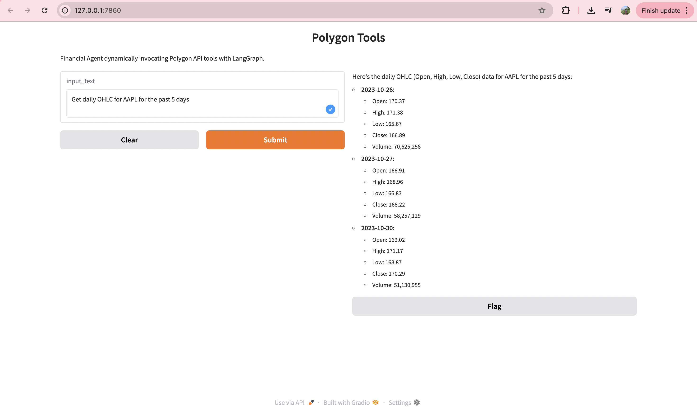
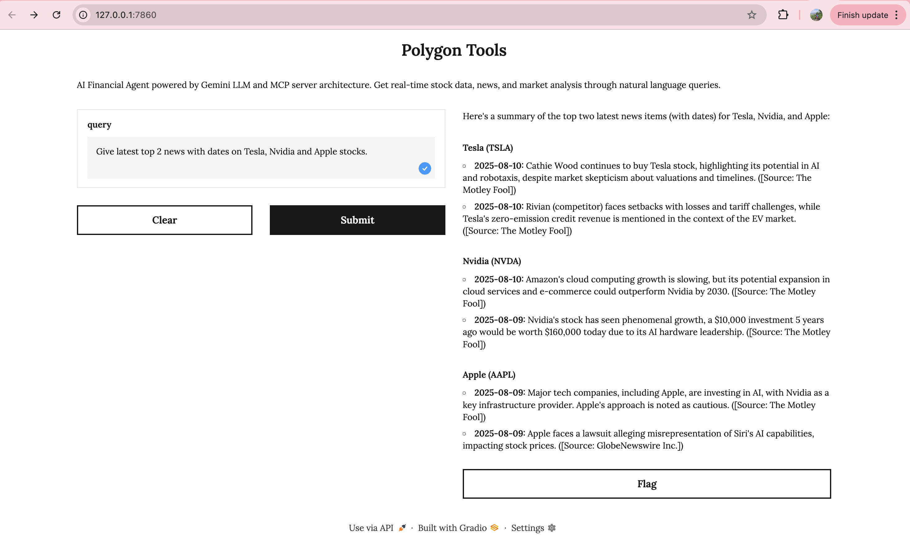

# FinBot: Polygon Financial Agent - Two Architectural Approaches

A financial AI agent demonstrating two different architectures for building production-ready AI systems with Polygon.io market data.

## 🏗️ Architecture Comparison

This project showcases **two approaches** to building the same financial agent:

### 1. Direct Agentic AI (`Polygon_Tools_UI.py`)
```
+--------------------------------------------------+
|              Single Process                      |
|  +-------------+  +-------------+  +-----------+ |
|  |   Gradio    |  | LangGraph   |  | Polygon   | |
|  |     UI      |<->|   Agent     |<->|  Tools    | |
|  +-------------+  +-------------+  +-----------+ |
|                                           |      |
+-------------------------------------------|------+
                                            |
                                            v
                                  +-------------------+
                                  |   Polygon.io API  |
                                  +-------------------+
```

### 2. MCP Server-Client Architecture (`MCP_Client.py` + `Polygon_MCP_server.py`)
```
+-------------------+       +-------------------+       +-------------------+       +-------------------+
|  User Interface   |       |  Financial Agent  |       |    MCP Client     |       | Polygon MCP Server|
|  (CLI / Gradio)   |<----->| (LangGraph Agent) |<----->|  (Communication)  |<----->| (FastMCP Server)  |
|                   |       |                   |       |                   |       |                   |
|  - User Queries   |       |  - Gemini LLM     |       |  - Tool Discovery |       |  - Polygon Tools  |
|  - Response Display|       |  - Query Processing|       |  - Request/Response|      |  - API Wrapper    |
+-------------------+       +-------------------+       |  - STDIO Transport|       +-------------------+
                                                        |  - Error Handling |                   |
                                                        +-------------------+                   v
                                                                                    +-------------------+
                                                                                    |   Polygon.io API  |
                                                                                    +-------------------+
```

## 🏗️ Outputs

### 1. Direct Agentic AI (`Polygon_Tools_UI.py`)



*The Gradio web interface for natural language financial queries*

### 2. MCP Server-Client Architecture (`MCP_Client.py` + `Polygon_MCP_server.py`)



## 🚀 Quick Start

### Prerequisites
```bash
pip install -r requirements.txt
```

Create `.env` file:
```env
POLYGON_API_KEY=your_polygon_api_key
GEMINI_API_KEY=your_gemini_api_key
```

### Option 1: Direct Agentic AI (Simple)
```bash
python Polygon_Tools_UI.py
```
Opens Gradio web interface at `http://localhost:7860`

### Option 2: MCP Server-Client (Production-Ready)
```bash
# Web interface
python MCP_Client.py web

# Terminal interface  
python MCP_Client.py
```

## 🔧 Available Tools

Both approaches provide the same financial tools:

| Tool | Description | Example Query |
|------|-------------|---------------|
| **Stock Quotes** | Real-time prices | "What's Apple's current price?" |
| **Company News** | Recent headlines | "Get Tesla news" |
| **Financials** | Financial statements | "Show Microsoft's financials" |
| **Market Data** | Historical aggregates | "NVDA daily data" |

## 📊 Architecture Comparison

| Feature | Direct Agentic AI | MCP Server-Client |
|---------|-------------------|-------------------|
| **Complexity** | Simple, single file | Modular, multi-process |
| **Deployment** | Quick prototype | Production-ready |
| **Scalability** | Limited | High |
| **Security** | Basic | Process isolation |
| **Tool Management** | In-process | Independent server |
| **Resource Usage** | Single process | Distributed |
| **Development Speed** | Fast | Moderate |
| **Maintenance** | Harder to extend | Easy to modify |

## 🎯 When to Use Each Approach

### Choose **Direct Agentic AI** when:
- ✅ Rapid prototyping and testing
- ✅ Simple, single-user applications  
- ✅ Limited tool requirements
- ✅ Quick demonstrations or POCs

### Choose **MCP Server-Client** when:
- ✅ Production deployments
- ✅ Multiple tools from different sources
- ✅ Enterprise security requirements
- ✅ Team collaboration on tool development
- ✅ Scalability and reliability needs

## 🏭 Why MCP Architecture Matters

The **Model Context Protocol (MCP)** approach provides:

### **Modularity**
- Tools run in isolated processes
- Independent updates and deployment
- Mix tools from different providers

### **Scalability**  
- Distribute tools across servers
- Better resource management
- Horizontal scaling capabilities

### **Security**
- Process isolation
- Separate API key management
- Reduced attack surface

### **Production Readiness**
- Robust error handling
- Monitoring and observability
- Enterprise compliance

## 💼 Example Queries

Try these queries with either approach:

```
"What's the latest price for AAPL?"
"Compare Tesla and Apple stock performance"
"Get recent news about Microsoft"  
"Show me Netflix's financial data"
"Which tech stock performed best today?"
"Analyze NVDA's market trends"
```

## 📁 Project Structure

```
FinBot/
├── Polygon_Tools_UI.py      # Direct agentic AI approach
├── MCP_Client.py           # MCP client with agent
├── Polygon_MCP_server.py   # MCP server with tools
├── requirements.txt        # Dependencies
├── .env                   # Environment variables
└── README.md             # Documentation
```

## 🛠️ Technical Stack

**Shared Components:**
- **AI Model**: Google Gemini 1.5 Pro
- **Agent Framework**: LangGraph  
- **Financial Data**: Polygon.io API
- **Web Interface**: Gradio

**MCP-Specific:**
- **Protocol**: Model Context Protocol
- **Communication**: STDIO transport
- **Server**: FastMCP

## 📈 Performance Considerations

### Direct Agentic AI:
- Lower latency (in-process)
- Higher memory usage (everything loaded)
- Resource sharing between components

### MCP Server-Client:
- Slightly higher latency (IPC overhead)
- Better resource isolation
- Independent scaling of components

**Start with Direct Agentic AI for experimentation, evolve to MCP Server-Client for production.**